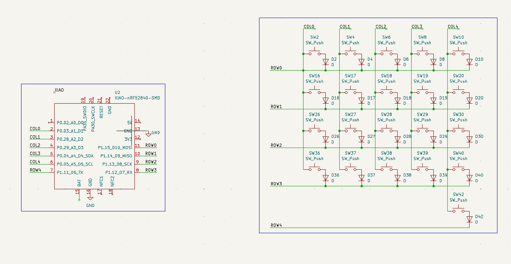
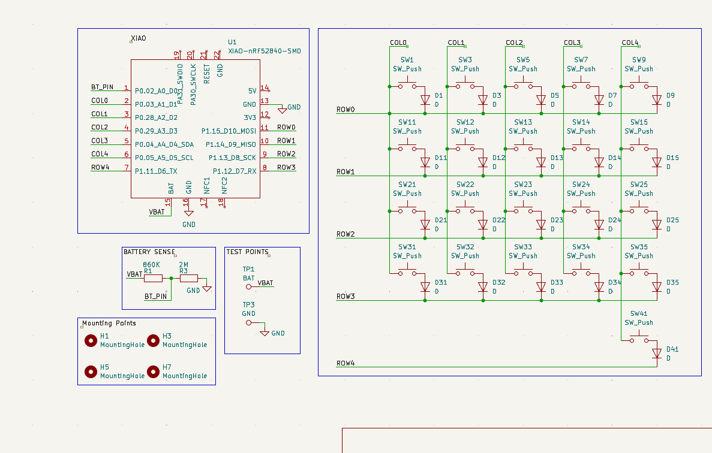
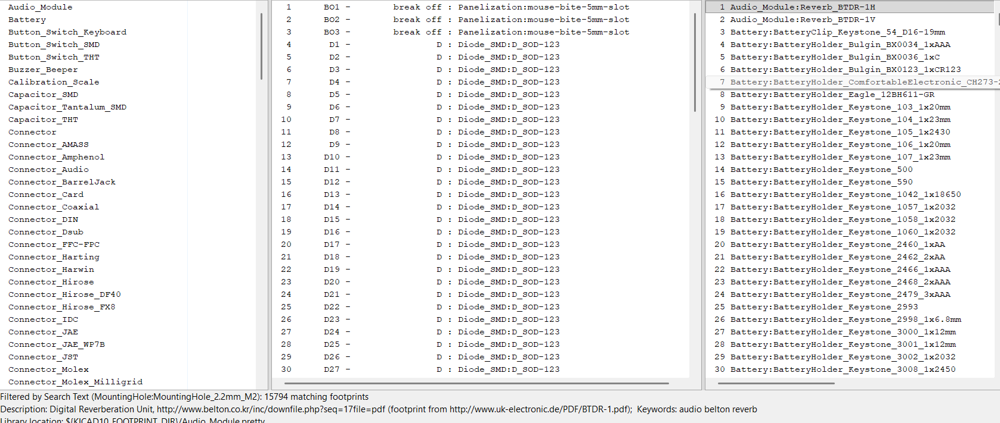

# October 1: Designed the schematic layout

Spent about an hour designing the schematic and trying to figure out how to import footprints and symbols. This was pretty simple because i already dealt with this once, but i faced problems this time too. Apart from that, i just followed the guide and added hierarchical sheets to build the schematic .

**Total time spent: 1 hour, 50% time logged on lapse**

# October 2: Completed designing the schematic

Spent about an 45 minutes finishing off the schematic adding the battery sense and the mounting holes (according to the guide). Struggled quite a bit at the mounting holes because i didnt know where to look for the right symbols

**Total time spent: 0.75hr**

# October 2: Assigned footprints to symbols

Simple step here. I assigned the correct footprints to the respective symbols and now, im ready to go for the pcb :D

**Total time spent: 0.25hr**
